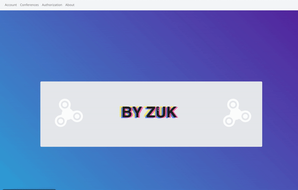

# Conference – Spring Boot + React web app

[](https://github.com/andronaft/JAVA_WEB-APP_Spring_ReactJS/actions/workflows/ci.yml)

A small web app for announcing conferences: people can browse upcoming conferences,
sign up and join them, and an admin creates, reschedules and cancels them.

**Stack**

* **Java 17 / Spring Boot 4** – REST API, `JdbcTemplate` DAOs, transactions
* **H2** (in-memory, default) or **PostgreSQL**
* **React 18** (Create React App) – single page client, built into `src/main/resources/static`
* **Maven**, **JUnit 5 / MockMvc**, **Jest / React Testing Library**, **GitHub Actions**

---

## Agenda

There are three kinds of users.

1. ***Guests*** (not logged in)
2. ***Authorized users***
3. ***Admin***

### They have access to different functionality

> ***Guests***
> > * Can only watch conference information

> ***Authorized users***
> > * Can join a conference
> > * Can view their account information

> ***Admin***
> > * Can remove participants from a conference
> > * Can change the date and time of a conference
> > * Can cancel a conference
> > * Can create a new conference

---

## Quick start

Requirements: **JDK 17+** and **Maven 3.9+** (Node.js is only needed to work on the UI).

```bash
mvn spring-boot:run
# or
mvn package && java -jar target/conference.jar
```

Open <http://localhost:8080>. The app starts with an in-memory H2 database filled with
demo data (`src/main/resources/data-h2.sql`), so every restart begins from a clean state.

| Login   | Password | Role  |
|---------|----------|-------|
| `admin` | `admin`  | admin |
| `demo`  | `demo`   | user  |

The port can be changed with the `PORT` environment variable.

### PostgreSQL

```bash
export SPRING_PROFILES_ACTIVE=postgres
export DB_URL=jdbc:postgresql://localhost:5432/conference
export DB_USERNAME=conference
export DB_PASSWORD=...        # keep credentials out of the repository
java -jar target/conference.jar
```

The tables are created on start (`schema.sql`, safe to run repeatedly). No demo data is
loaded, so create the rooms and the first admin yourself: register in the UI, then

```sql
INSERT INTO ROOM (NAME, FIRSTFLOORCAPACITY, SECONDFLOORCAPACITY) VALUES ('Main hall', 50, 30);
UPDATE PARTICIPANT SET ROLE = 'admin' WHERE LOGIN = 'your-login';
```

### Frontend development

```bash
cd frontend
npm install
npm start               # http://localhost:3000, API requests are proxied to :8080
npm test
npm run build:spring    # rebuild the UI served by Spring Boot (src/main/resources/static)
```

---

## Database

There are three tables: `ROOM`, `PARTICIPANT` and `CONFERENCE`.

The schema is in [`schema.sql`](src/main/resources/schema.sql) (works on H2 and PostgreSQL),
the demo data in [`data-h2.sql`](src/main/resources/data-h2.sql).
Participants of a conference and conferences of a participant are stored as comma
separated id lists (`"1,4,"`) in `CONFERENCE.ID_PARTICIPANT` and
`PARTICIPANT.ID_CONFERENCE_PARTICIPANT`.

---

## Backend

```
src/main/java/com/zuk/conference
├── controller   MainController (JSON API), SpaController (serves the React routes)
├── service      ConferenceService, ParticipantService – business rules, @Transactional
├── dao          ConferenceDAO, ParticipantDAO, RoomDAO – JdbcTemplate implementations in dao/impl
├── model        Conference, Participant, Room
└── auxiliary    IdList (id list helper), PasswordHasher (BCrypt), ArrayWithAmount
```

### API

Actions answer with a one element array holding a message for the user, e.g. `["Conference was created"]`.
Parameters are sent as form fields (`application/x-www-form-urlencoded`).

| Method | Path                          | Parameters                                                        | Who            |
|--------|-------------------------------|-------------------------------------------------------------------|----------------|
| GET    | `/getAllConference`           | –                                                                 | everyone       |
| POST   | `/register`                   | `firstname`, `lastname`, `birthday`, `login`, `password`          | everyone       |
| POST   | `/login`                      | `login`, `password`                                               | everyone       |
| POST   | `/logout`                     | –                                                                 | logged in user |
| GET    | `/getAccount`                 | –                                                                 | logged in user |
| POST   | `/joinConference`             | `conference_id`                                                   | logged in user |
| POST   | `/createconf`                 | `name`, `id_room`, `datee`, `timee`, `admin_id`, `admin_password` | admin          |
| POST   | `/changeConfTime`             | `conference_id`, `datee`, `timee`, `admin_id`, `admin_password`   | admin          |
| POST   | `/removeParticipantFromConf`  | `conference_id`, `id_participant`, `admin_id`, `admin_password`   | admin          |
| POST   | `/cancelConf`                 | `conference_id`, `admin_id`, `admin_password`                     | admin          |

The logged in user is kept in the HTTP session (cookie). Passwords are hashed with BCrypt;
accounts with the MD5 hashes of the first version are upgraded on their next login.

---

## Tests

```bash
mvn verify                                   # unit + MockMvc integration tests (H2)
cd frontend && CI=true npm test              # React tests
```

`PostgresSmokeTest` additionally runs against PostgreSQL when `DB_URL` points to one;
GitHub Actions runs everything on every push to `master` and on pull requests.

---

```
String lastly = "you'll see  a cool toxic feature"
boolean do_you_scroll_below = (0 == (7 * (4 ^ (2))%(3)));
if (do_you_scroll_below && users.getPresense){
    sout(lastly)
}
```


